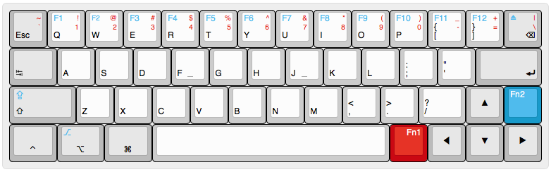
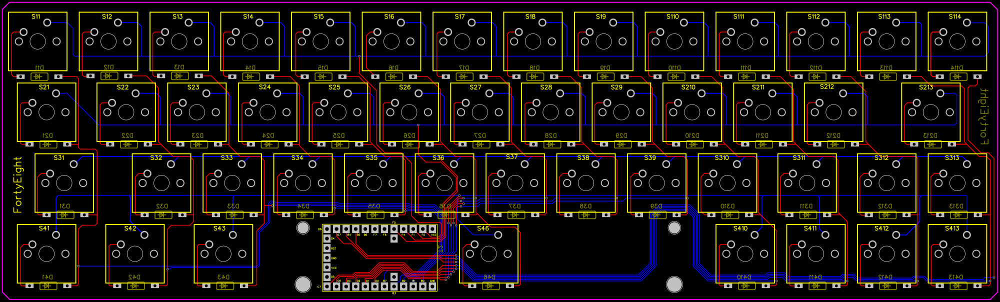

# The FortyEight RP2040-Zero – KMK Edition


## Default Layout



---

## PCB



---

## Wiring

```
Rows:             Columns:
f0  - 14          b0  - 0
f1  - 15          b1  - 1
f4  - 26          b2  - 2
f5  - 27          b3  - 3
                  b7  - 4
                  d0  - 5
                  d1  - 6
                  d2  - 7
                  d3  - 8
                  c6  - 9
                  c7  - 10
                  d7  - 11
                  b4  - 12
                  b5  - 13
```


---

## Install

1. Install CircuitPython on the RP2040-Zero.  
   [Installation Guide →](https://learn.adafruit.com/welcome-to-circuitpython/installing-circuitpython)

2. Copy the firmware files (`boot.py`, `code.py`, etc.) to the root of the **CIRCUITPY** drive.

---

🎉 You're ready to go!
