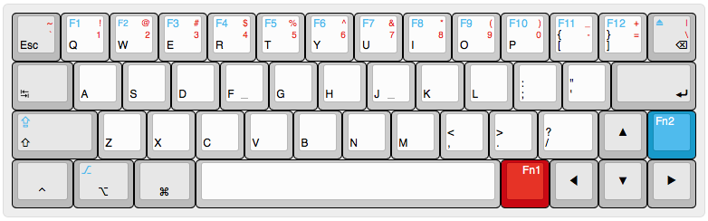
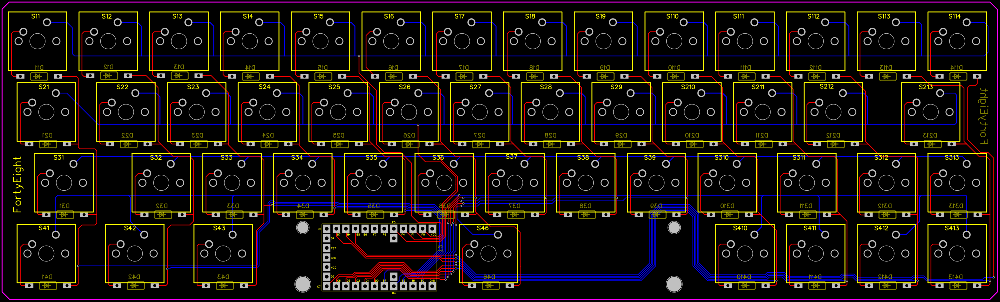

# The FortyEight RP2040-Zero – KMK Edition

This repository contains the configuration and wiring details for **The FortyEight** mechanical keyboard, utilizing the RP2040-Zero microcontroller and KMK firmware.

## Default Layout

---

## PCB Overview

---

## Wiring Configuration

Connect the matrix rows and columns to the corresponding GPIO pins on the RP2040-Zero as outlined below. Ensure all connections are secure for optimal performance.

**Rows:**
* `f0` ➡️ **14**
* `f1` ➡️ **15**
* `f4` ➡️ **26**
* `f5` ➡️ **27**

**Columns:**
* `b0` ➡️ **0**
* `b1` ➡️ **1**
* `b2` ➡️ **2**
* `b3` ➡️ **3**
* `b7` ➡️ **4**
* `d0` ➡️ **5**
* `d1` ➡️ **6**
* `d2` ➡️ **7**
* `d3` ➡️ **8**
* `c6` ➡️ **9**
* `c7` ➡️ **10**
* `d7` ➡️ **11**
* `b4` ➡️ **12**
* `b5` ➡️ **13**

---

## Installation

1. **Install CircuitPython:** Flash the RP2040-Zero with the appropriate version of CircuitPython. For detailed instructions, refer to the [Official CircuitPython Installation Guide](https://learn.adafruit.com/welcome-to-circuitpython/installing-circuitpython).
2. **Deploy Firmware:** Copy the necessary firmware files (`boot.py`, `code.py`, etc.) directly to the root directory of the **CIRCUITPY** drive.

Once the file transfer is complete, the keyboard is fully configured and ready for use.
