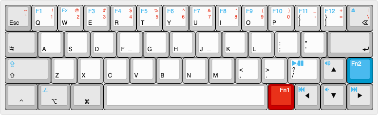

# The FortyEight rp2040-zero KMK edition

**Default layout:**

### PCB

### Wiring

Row:
f0 - 14
f1 - 15
f4 - 26
f5 - 27

col:
b0 - 0
b1 - 1
b2 - 2
b4 - 3
b7 - 4
d0 - 5
d1 - 6
d2 - 7
d3 - 8
c6 - 9
c7 - 10
d7 - 11
b4 - 12
b5 - 13

### Install

1 install circuit python on the rp2040
2 copy the firmware (boot.py code.py etc.) on the root of the circuitpython drive
